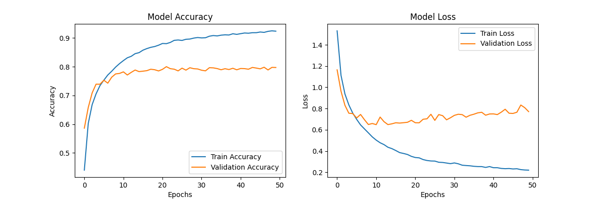
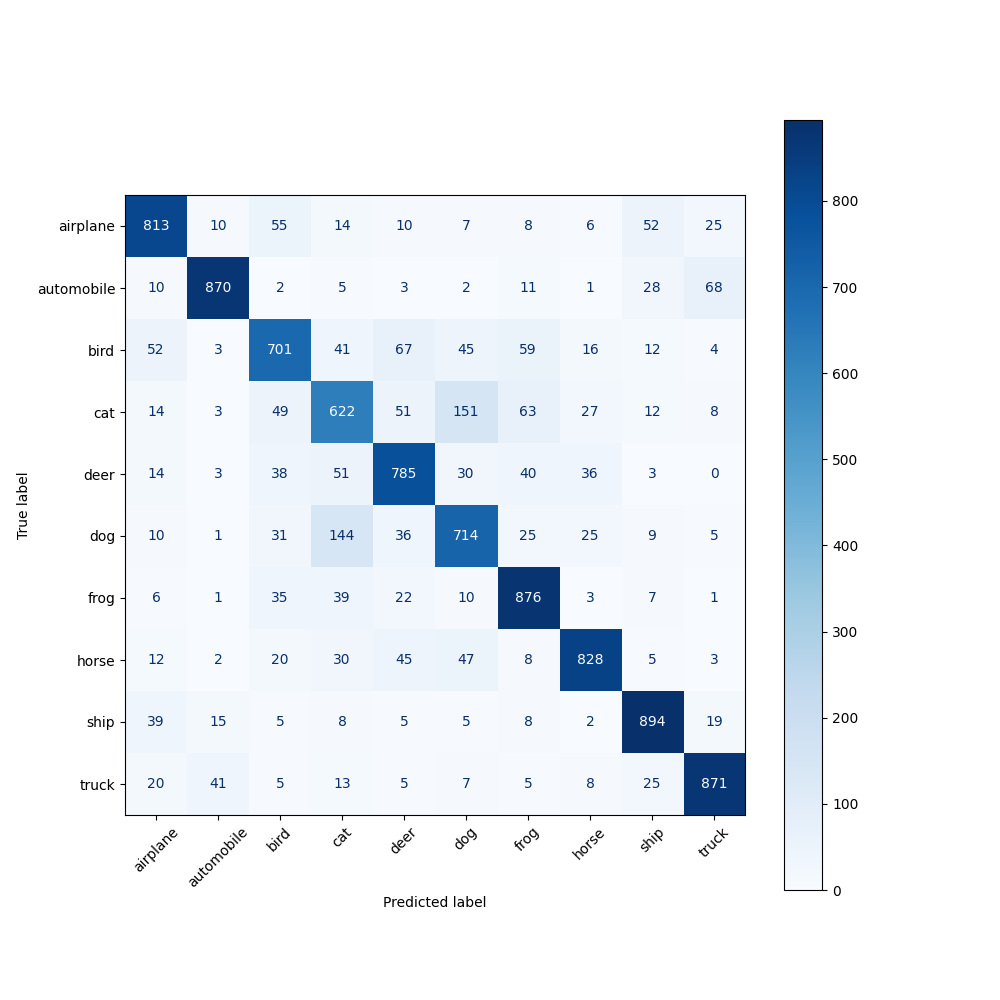

# CIFAR-10 Classification

## Install

Enter virtual environment of your liking and install the requirements:
```shell
pip install -r requirements.txt
```

Run the model training script:
```shell
python main.py
```


## Results
### Training History

### Confusion Matrix



